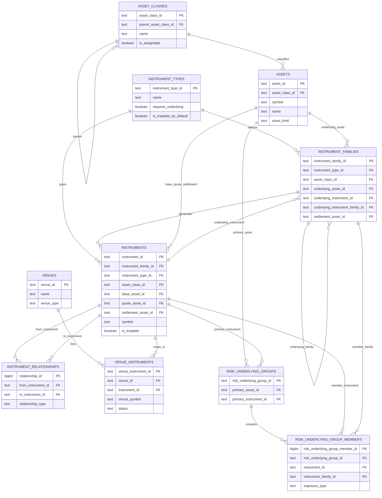

# Instrument Manager ERD

```mermaid
erDiagram
    ASSET_CLASSES ||--o{ ASSET_CLASSES : parent
    ASSET_CLASSES ||--o{ ASSETS : classifies
    INSTRUMENT_TYPES ||--o{ INSTRUMENT_FAMILIES : defines
    INSTRUMENT_TYPES ||--o{ INSTRUMENTS : types
    INSTRUMENT_FAMILIES ||--o{ INSTRUMENT_FAMILIES : underlying_family
    INSTRUMENT_FAMILIES ||--o{ INSTRUMENTS : generates
    ASSETS ||--o{ INSTRUMENT_FAMILIES : underlying_asset
    ASSETS ||--o{ INSTRUMENTS : base_quote_settlement
    INSTRUMENTS ||--o{ INSTRUMENT_FAMILIES : underlying_instrument
    INSTRUMENTS ||--o{ INSTRUMENT_RELATIONSHIPS : from_instrument
    INSTRUMENTS ||--o{ INSTRUMENT_RELATIONSHIPS : to_instrument
    VENUES ||--o{ VENUE_INSTRUMENTS : lists
    INSTRUMENTS ||--o{ VENUE_INSTRUMENTS : maps_to
    ASSETS ||--o{ RISK_UNDERLYING_GROUPS : primary_asset
    INSTRUMENTS ||--o{ RISK_UNDERLYING_GROUPS : primary_instrument
    RISK_UNDERLYING_GROUPS ||--o{ RISK_UNDERLYING_GROUP_MEMBERS : contains
    INSTRUMENTS ||--o{ RISK_UNDERLYING_GROUP_MEMBERS : member_instrument
    INSTRUMENT_FAMILIES ||--o{ RISK_UNDERLYING_GROUP_MEMBERS : member_family

    ASSET_CLASSES {
        text asset_class_id PK
        text parent_asset_class_id FK
        text name
        boolean is_assignable
    }

    ASSETS {
        text asset_id PK
        text asset_class_id FK
        text symbol
        text name
        text asset_kind
    }

    INSTRUMENT_TYPES {
        text instrument_type_id PK
        text name
        boolean requires_underlying
        boolean is_tradable_by_default
    }

    INSTRUMENT_FAMILIES {
        text instrument_family_id PK
        text instrument_type_id FK
        text asset_class_id FK
        text underlying_asset_id FK
        text underlying_instrument_id FK
        text underlying_instrument_family_id FK
        text settlement_asset_id FK
    }

    INSTRUMENTS {
        text instrument_id PK
        text instrument_family_id FK
        text instrument_type_id FK
        text asset_class_id FK
        text base_asset_id FK
        text quote_asset_id FK
        text settlement_asset_id FK
        text symbol
        boolean is_tradable
    }

    INSTRUMENT_RELATIONSHIPS {
        bigint relationship_id PK
        text from_instrument_id FK
        text to_instrument_id FK
        text relationship_type
    }

    VENUES {
        text venue_id PK
        text name
        text venue_type
    }

    VENUE_INSTRUMENTS {
        text venue_instrument_id PK
        text venue_id FK
        text instrument_id FK
        text venue_symbol
        text status
    }

    RISK_UNDERLYING_GROUPS {
        text risk_underlying_group_id PK
        text primary_asset_id FK
        text primary_instrument_id FK
    }

    RISK_UNDERLYING_GROUP_MEMBERS {
        bigint risk_underlying_group_member_id PK
        text risk_underlying_group_id FK
        text instrument_id FK
        text instrument_family_id FK
        text exposure_type
    }
```
