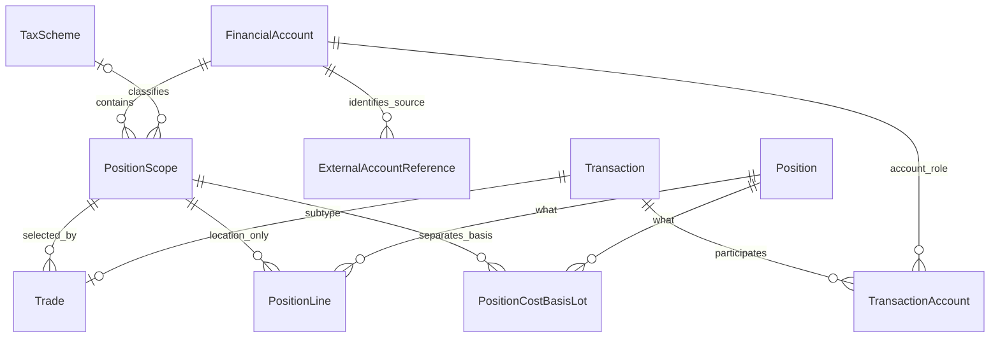

# Financial Account — 实施设计

更新：2026-09-09。状态：**FA-1～FA-5 已实现；结果见 [专项验收](../history/FINANCIAL_ACCOUNT_ACCEPTANCE.md)**。

依据：[Financial Account PRD v1.0](Financial_Account_PRD.md)、[Canonical PRD](PRD.md)、[Logical Schema](Logical_Data_Model_Schema_Spec.md)、[Web Spec](<Web_&_Data_Entry_Spec.md>)。本轮静态代码基线为本地 main `6b3e66b`。用户提供的 Financial Account PRD 原文保持不变，仅修正文件名拼写并迁入统一文档目录。

本设计把已确定的领域规则落到当前代码、持久化、接口和验收。本轮功能已实现；原 S0～S10 的测试结果属于旧实现，本轮另有专项验收。本文的接口命名、约束分工和实施顺序为工程方案，不新增金融产品或税务计算规则。

## 1. 模型与模块归属



PositionLine 的 OWNERSHIP 行只有 Owner；图中 PositionScope 关系仅适用于 LOCATION 行。支持 Position 的账户至少一个 scope，纯现金账户可以没有。所有新实体均属于 `ledger.investment` 参考数据；Instrument Manager 继续只拥有 Observable / Product / Listing 等 instrument 主数据。Portfolio Manager 负责分析、估值、API 与 Web。

| 概念 | Canonical key / 关系 | 不承担的职责 |
|---|---|---|
| Cash | FinancialAccount × Currency | 不按 scope 或外部号码拆分 |
| Position identity | Observable → 唯一 Position | 不因账户、税分类、scope 新建 Position |
| Ownership | Position × Owner | 不保存 scope |
| Location quantity | Position × PositionScope | 不保存 financial_account_id |
| Cost basis | Position × Owner × PositionScope | 不跨 scope 选择 lot |
| TransactionAccount | Transaction × account role → FinancialAccount | 不加入 scope 或 TaxScheme |
| ExternalAccountReference | FinancialAccount × external account number | 不是 Holdings 维度，不绑定单个 scope |

## 2. 相对本地 main 基线的实现范围

以下路径均相对仓库根目录；记录实施前的 main 基线与本轮对应修改。

| 当前落点 | 当前行为 | 目标修改 |
|---|---|---|
| `ledger/ledger/investment/persistence/001_foundation.sql` | 账户只有 code/name；trigger 锁定 PK 与 code | 增加 institution_type、country_or_region；仅保留 PK 身份保护，允许非 PK correction |
| `ledger/ledger/investment/persistence/003_trades.sql` | Trade 无 scope；LOCATION/Lot 使用 account FK | 引入 Trade scope、替换 LOCATION/Lot FK 与 bucket 索引 |
| `ledger/ledger/investment/persistence/store.py` | 账户创建、rename；schema v6 初始化 | 新 reference 创建/读取、原子 bootstrap、目标 schema 识别 |
| `ledger/ledger/investment/application/trades.py` | normalize 从 payload 读取 account_id；build 使用账户现金 | normalize/save/load 保存 scope；cash 路径继续使用 account_id |
| `ledger/ledger/investment/position/ledger.py` | State、matches、save、inverse、remaining lots 使用 account | 全部改为 scope bucket；保留 SELF ownership 总量 |
| `ledger/ledger/investment/application/service.py`、`queries.py` | commands、重演、余额/追溯查询 | 规范 payload、scope 容量、跨 scope 共享现金依赖、账户派生汇总 |
| `ledger/ledger/investment/validation/` | account 维度的投影/lot 对账 | 独立验证 scope membership、scope lot 消耗与账户汇总 |
| `ledger/ledger/investment/imports/` | account/instrument 解析与去重 | source → account → scope，保留映射与原始号码证据 |
| `portfolio_manager/portfolio_manager/holdings/analysis.py`、`integrations/market.py` | 消费 ledger balances 并估值 | 保留账户顶层，增加 scope 明细，防止重复计值 |
| `portfolio_manager/portfolio_manager/holdings/api.py`、`web/` | 账户 rename、Trade 无 scope 控件 | reference 查询、scope 选择、移除普通账户编辑入口 |

不改通用 personal ledger、legacy records/ledger_bridge、backtest account 或 plumber broker account 模型。它们名称相似，但不是本 PRD 的 canonical FinancialAccount。

## 3. 物理模型与约束

沿用 SQLite direct SQL、整数 opaque ID；对 API 输出 ID 字符串，调用者不得推导 ID 语义。reference IDs 在库内稳定，account_code/scope_code 仅作可读解析键。Decimal 仍以 TEXT 保存，不通过 SQL REAL/SUM 计算金额。

| 表 | 列 | 数据库约束 |
|---|---|---|
| financial_accounts | financial_account_id、account_code、display_name、country_or_region?、institution_type | PK；code UNIQUE NOT NULL；name NOT NULL；type CHECK IN ('BANK','BROKER-DEALER','INSURER') |
| external_account_references | external_account_reference_id、financial_account_id、external_account_number | PK；account FK NOT NULL；number TEXT NOT NULL；UNIQUE(account, number) |
| tax_schemes | tax_scheme_id、scheme_code、display_name、country_or_region? | PK；scheme_code UNIQUE NOT NULL；name NOT NULL |
| position_scopes | position_scope_id、financial_account_id、scope_code、display_name、tax_scheme_id? | PK；account FK NOT NULL；可空 tax FK；UNIQUE(account, scope_code) |
| trades | 增加 position_scope_id | FK → position_scopes，NOT NULL |
| position_lines | 删除 financial_account_id，增加 position_scope_id? | FK；OWNERSHIP/LOCATION 维度 CHECK |
| position_cost_basis_lots | 删除 financial_account_id，增加 position_scope_id | FK NOT NULL；原 source_transaction_id UNIQUE 保留 |

Required code/name/number 拒绝空白；外部号码按字符串保留前导零，不做数字转换或无依据的大小写折叠。code 沿用大小写敏感匹配。country_or_region 是可空 reference 属性，不与 TaxScheme country 强制相等。暂无账户分类的 source（例如 PRD 提及 Binance）由操作者从已批准的三个类型中明确选择；不增加 CRYPTO_EXCHANGE 枚举或自动猜测。

LOCATION 维度约束：

```sql
CHECK (
  (line_type = 'OWNERSHIP' AND owner_id IS NOT NULL AND position_scope_id IS NULL)
  OR
  (line_type = 'LOCATION' AND owner_id IS NULL AND position_scope_id IS NOT NULL)
)
```

跨表合同不能靠两个独立 FK 保证：命令在同一 Unit of Work 内验证 `Trade.position_scope_id → account = TransactionAccount.ACCOUNT.account`，且 ACCOUNT 恰好一行。独立 validator 再从存储事实校验一次。拒绝时不得留下 Transaction、receipt、Journal、Position、lot/allocation 或 import link 的部分记录。

建议索引：`position_scopes(financial_account_id, scope_code)`（唯一约束已覆盖）；`position_lines(position_id, position_scope_id, position_entry_id)`；`position_cost_basis_lots(position_id, owner_id, position_scope_id, source_transaction_id)`；`trades(position_scope_id, transaction_id)`。Cash / Journal 原索引保留。

Reference 与经济事实的可变性分开处理：

- financial_account_id 保持稳定；移除现有 account_code immutability trigger 的非 PK 部分，不对其他账户字段增加历史事实锁。
- TaxScheme 的 code/name/country 允许 correction；不提供普通用户维护 UI。
- PositionScope 的账户归属不可重写以迁移历史持仓；更换 tax treatment 新增 scope。MVP 不需要 tax_scheme_id 的 DB immutability trigger，也不提供此类编辑 workflow。
- ExternalAccountReference 历史行不删不改，号码替换新增行。各类被引用 reference 不级联删除，经济表仍 append-only。
- 不增加 status、is_active、closed_at、valid_from/to、Institution、CashScope、generic classification 或 transfer subtype。

### 新库初始化

依 PRD §64 使用 fresh-database target schema，不建设旧用户数据迁移或 compatibility layer。实现时引入明确的新 schema revision（已采用 v7，仅新库），同时修订 fresh-install 建表路径；不能只编辑 001/003 而让已有 v6 marker 被误判成新模型。

启动遇到旧结构明确报不兼容，并要求配置一个新的 DB 文件路径；不得自动 drop/rebuild 原库。这个检查只避免误用，不承担 legacy migration。所有新 reference/经济约束在新空库一次建立；重启验证 schema、FK 与必需约束一致。

初始化先配置 TaxScheme，再创建 FinancialAccount + 所需 PositionScopes + 当前需要的 external references。一个账户及其 scopes 在同一事务中创建，失败整体回滚。简单支持 Position 的账户创建 DEFAULT；复杂账户只创建实际 NISA/TOKUTEI/IPPAN 等 scopes；纯现金 BANK 无需 DEFAULT。创建请求中以临时输入 `position_scopes` 列表表达，不添加持久 supports_positions/account_type 字段。

不自动为所有账户制造 DEFAULT，也不复制全部外部账户。初始化不导入真实交易或猜测真实外部号码；测试样例只用于临时数据库。库初始化幂等重启不重复 reference，也不把余额作为 seed。

## 4. Trade 命令、重演与冲销

Canonical Trade 必须持久化 exactly one position_scope_id。Web / import 可以在只有一个 scope 时自动解析，但应在 canonical command 前解析成稳定 ID；canonical API 缺少该字段直接报错，不在 replay 时查询“当前默认 scope”。

1. 校验 FinancialAccount、Product/Listing 和 scope；确认 scope 归属匹配 ACCOUNT。
2. 固定 scope ID、金额/数量、fees 与 Book FX evidence，规范 payload；幂等 hash 包含 scope ID。相同 request key 换 scope 返回冲突。
3. 使用已有有效历史规则试算；Cash 容量与 carrying basis 仍按 account/currency。
4. Position 仍由 Observable 唯一解析；OWNERSHIP 为 SELF，LOCATION 为 Trade scope。
5. BUY 新 lot 使用 `(position_id, SELF, position_scope_id)`。SELL 仅在同 bucket 内按既有 LOWEST_BOOK_COST 规则选择 lot，HKD 单位成本相同时按数值 source_transaction_id 排序。
6. 同一事务保存 canonical Trade 与所有 effects、receipt / import link。

scope LOCATION、SELF ownership、同 bucket lot 数量均须足够。不允许跨 scope 借用库存，也不能以 FinancialAccount 汇总余额通过 scope 容量检查。TaxScheme 不改变 book-cost 算法，不实现税务成本或税额计算。

**补录与冲销：** scope 隔离不等于账户现金隔离。例如 NISA 买入减少共享 JPY 后，TOKUTEI 的后续 BUY 可能因现金不足或历史成本变化而不能重演。因此仍按现有完整有效历史执行依赖检查，跨 scope 和经内部现金转账传播到其他账户的影响均需检查。不能把检查范围缩成一个 scope。

Reversal 的 PositionLine 必须复制 target scope ID 并精确取反；不按当前 DEFAULT 或 tax label 重新解析。反向分录不创建负 lot/allocation；已冲销 BUY/SELL 的 active lot/allocation 仍由关系派生。scope 之间移动须未来 Transaction subtype，本期没有修改旧 scope assignment 或伪造普通 Trade 的入口。

## 5. 查询、估值与 UI

Ledger 首先形成 scope 粒度的冻结数量/成本：`PositionLine LOCATION → scope`，`active lots − active allocations → scope`；按 scope 数量对账，再关联 PositionScope 汇总 account。Position 总量与 SELF ownership、总历史成本与 INVESTMENT 进行独立对账。

账户级结果保留 financial_account_id，但它是 join 后的 read DTO，绝不能回写到 LOCATION/Lot。建议每个账户 Position 行附 `scopes` 明细，包含 scope ID/code/name、可空 TaxScheme、quantity、remaining book cost。scope 过滤时返回明确的过滤范围，不能把局部总额标成全账户资产。

估值对同一 Observable/as-of 复用相同 Market Price / Market FX。Cash 只计一次，scope 明细与账户汇总二者不能同时累加。平均历史成本 = 汇总 remaining book cost / 汇总 quantity，不对 scope 均价取平均；quantity=0 时均价为空。沿用缺失估值、zero price、as-of 和历史 FX 规则。

Trade 表单先选 Financial Account：零 scope 阻止提交并提示完成参考设置；一个 scope 自动选择，DEFAULT 控件隐藏；多个 scopes 要求明确选择。切换账户清除 scope 与旧 preview。DEFAULT 仅隐藏标签，不隐藏余额；多 scope 账户的 DEFAULT 数量若存在，仍参与汇总并在明细以账户默认持仓呈现。

Holdings 默认看 FinancialAccount totals，可展开 meaningful scopes。Transactions/detail/preview 显示所选 scope 及只读 TaxScheme。表单不独立选择 TaxScheme。Settings 提供账户创建及 reference 只读信息；不提供普通账户 rename、TaxScheme 管理、scope 改税分类、归档或删除 workflow。系统文案继续英文，用户名称与来源原文保留。

## 6. API 与导入合同

以下为已实现接口合同；现有 account_id 命名保持用于 Trade 请求，与 canonical financial_account_id 含义相同。

| 接口 | 目标行为 |
|---|---|
| GET /api/accounts | 返回完整账户 reference 字段 |
| POST /api/accounts | code/name/type/country 及可选 position_scopes 创建输入；支持 Position 的账户原子建立至少一 scope |
| GET /api/accounts/{id}/position-scopes | 该账户全部 scopes 与只读 tax classification；纯现金账户返回空数组 |
| GET /api/accounts/{id}/external-account-references | 已登记外部号码；不返回虚构的 scope 绑定 |
| POST /api/transactions/trades | 现有 payload 增加必填 position_scope_id；preview 使用同一验证 |
| GET /api/holdings、/api/holdings/{position_id} | 账户层 + scope 明细，沿用 as_of 规则 |
| PATCH /api/accounts/{id} | 移除旧普通编辑路由与 UI；受控 reference correction 不等于常规用户编辑 |

错误继续使用现有 code taxonomy；scope 未找到为 REFERENCE_NOT_FOUND，账户/scope 不匹配为 VALIDATION_ERROR（field_errors.position_scope_id），导入不能唯一解析为 AMBIGUOUS_REFERENCE；SELL scope 不足为 INSUFFICIENT_POSITION / INSUFFICIENT_COST_BASIS，附 scope ID、required/available。HTTP 沿用 422 输入错误、409 容量/历史依赖/幂等冲突。零 scope 不因账户存在就允许交易通过。

CSV TRADE 增加 `position_scope_code`（在 account_code 内解析）、可选 `external_account_number`、`source_tax_label`。一个 scope 可自动解析；多个 scopes 必须通过显式 code 或 source mapping 唯一确定；显式值与来源规则冲突时保留 staging 错误，不默默选一边。

映射顺序为 source context → FinancialAccount → PositionScope。外部号码可在不同 FinancialAccount 重复，不能只凭全局号码查一个账户。一个号码对应多个 scopes 或多个号码映射一个 scope 均允许；具体规则放 Import domain，不在 ExternalAccountReference 上添加 scope FK。无唯一解析不得 canonicalize，也不得在导入时擅自创建 scope/TaxScheme。

原始 source row 保留号码及 tax label，staging payload 保存最终稳定 IDs，mapping override/evidence 保留解析依据；Transaction → import link → raw row 可追溯。提交重新验证引用与余额；成功后不改原始来源或 scope。账户 code/name correction 不重写历史 raw row。

source_system 继续存在于 Import provenance/dedup，**不加入 ExternalAccountReference**。来源 dedup 使用 source 的真实唯一范围：多个 external accounts 聚到同一 FinancialAccount 时必须保留 source_account_namespace，不能以汇总 account_code 替换。跨文件同 source ID 的经济 hash 应使用解析后的 account/scope IDs，不依赖可变显示名/code；相同 key 不同 scope 是冲突。无 source ID 沿用文件 hash + row 机制；不同文件相同经济内容只提示潜在重复。一个被来源聚合到多个 scopes 的行不能直接生成一笔 ordinary Trade，先留 staging，等待拆分为可唯一定位的真实交易记录。

## 7. 固定数值验收

以下是软件测试 fixture，不表示 NISA 税务规则；所有 book 值用 HKD，实际 fixture 使用内置 AAPL/USD，Book FX 和 Market FX 均固定 USD/HKD=1，以排除汇率干扰。FUTU_JP 下 NISA 和 TOKUTEI，AAPL 同一个 Observable/Position，fees=0，SELF。

| 步骤 | 输入 | 预期 |
|---|---|---|
| 1 | Deposit 5,000 到 FUTU_JP | 账户 Cash=5,000 |
| 2 | BUY NISA 50 × 10 | NISA quantity=50、cost=500；Cash=4,500 |
| 3 | BUY TOKUTEI 200 × 8 | TOKUTEI quantity=200、cost=1,600；Cash=2,900 |
| 4 | SELL NISA 100 × 12 | 拒绝；即使账户共有 250，也不能借用 TOKUTEI 50；所有表与 step 3 一致 |
| 5 | SELL NISA 20 × 12 | 只消费 NISA lot 20 / 200；Cash=3,140；realized gain=40 |
| 6 | 查询 Holdings | NISA 30 / 300，TOKUTEI 200 / 1,600；账户 quantity=230、cost=1,900 |
| 7 | Market Price=12 | NISA value=360，TOKUTEI=2,400，投资总值=2,760；总资产=5,900 |
| 8 | 冲销 step 5（沿用 target effective_date） | 恢复 step 3 状态；无负 lot；scope 精确反向且 TOKUTEI 不变 |

独立验收还需覆盖：

- 两个账户同 scope_code 合法，同账户重复 scope_code 拒绝；外部号码跨账户可重复，同账户重复拒绝。
- BANK 零 scope、DEFAULT 自动选择、多 scope 显式选择及切换账户清除选择；API 缺 scope、未知 scope、跨账户 scope 全拒绝。
- 同 Observable 不同 Product/Listing 不新增 Position；OWNERSHIP/LOCATION 非法维度、损坏的 scope FK 与故意篡改的 Trade-account membership 被 validator 发现。
- scope 内成本排序、相同单位成本按数值 ID、完整处置尾差；不能消费同账户其他 scope 的更便宜 lot。
- NISA 补录买入影响 TOKUTEI 后续共享现金，或经现金 transfer 影响其他账户时，正确拒绝且冻结记录不变。
- Reversal、as-of、依赖拒绝、幂等重试、同 key 不同 scope、并发 SELL 与写入故障整体回滚。
- 两个 external accounts 同外部交易 ID 映射同 FinancialAccount 仍是不同来源事件；同一号码跨 scopes 正确解析；歧义不入账；preview 后改映射重新预览。
- 无 source ID 重复文件、不完整 source namespace、原始号码前导零、code correction 后再次导入去重；Account/TaxScheme 参考 correction 不改变 canonical ID/余额。
- 全仓库原现金/FX/dividend 数值回归及模块隔离回归；无 scope 的现金事件照常工作，不新增 TaxScheme 计算。
- 新空库、重启、旧 schema 明确拒绝、备份/恢复；拒绝路径所有 canonical 表无部分写入，未访问或改写真实业务数据库。

## 8. 实施顺序与完成条件

| 阶段 | 范围 | 验收出口 | 当前状态 |
|---|---|---|---|
| FA-1 | fresh target schema、reference store、bootstrap、初始化工具 | 约束/幂等初始化/旧结构拒绝，reference 创建闭环 | 已验收 |
| FA-2 | Trade、Position、Lot、replay/reversal、validator | 固定数值场景和跨 scope 共享现金依赖通过 | 已验收 |
| FA-3 | Import mapping、来源证据、模板、dedup | 单/多 scope 解析、歧义与命名空间冲突通过 | 已验收 |
| FA-4 | API、表单、Settings、Holdings 聚合与展开 | 单 scope 隐藏、多 scope 选择、切换账户、英文错误和无重复计值 | 已验收 |
| FA-5 | 全回归、故障/并发、备份恢复、文档更新 | 记录实际结果并更新 PROJECT_PLAN、CSV_IMPORT、RUNBOOK | 已验收 |

UI/API 合同在 FA-1 定义，随 FA-2/FA-3 接通预览与错误，FA-4 完成整体交互。开发不需要再次决定 PRD 已 FINAL 的领域语义；只有必须改变 scope/现金/成本边界时才升级讨论。旧验收数字不复制为本轮通过证据。
